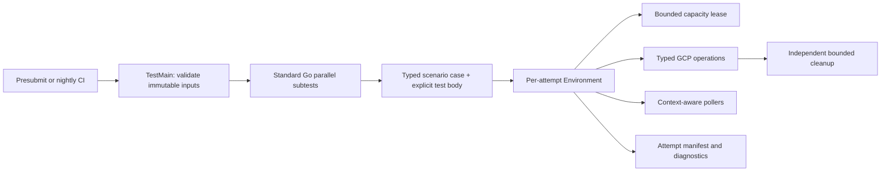

# E2E v2 architecture

## Overview

The POC in `e2e_tests_v2` replaces the custom executable and home-grown JUnit lifecycle with standard Go tests backed by a small OS Config-specific environment library. Its central ownership rule is:

> One subtest = one environment = one isolated attempt.

The top-level test body describes product behavior. The environment owns infrastructure allocation, deadlines, cloud operations, polling, resource identity, diagnostics, and cleanup.



## Execution model

1. **Suite initialization:** `TestMain` loads and validates the run configuration and immutable image manifest, creates shared GCP clients, and initializes the capacity scheduler before any scenario starts (`e2e_tests_v2/e2e_test.go`, `e2e_tests_v2/internal/testenv/suite.go`). Invalid global input fails before cloud resources are created.
2. **Typed case declaration:** A `scenario.Case` contains stable identity, category, platform, image key, bootstrap mode, and expected packages. It contains inputs, not execution logic (`e2e_tests_v2/internal/scenario/scenario.go`). This keeps matrix expansion type-safe without hiding test behavior in a custom DSL.
3. **Readable test body:** The actual Arrange -> Act -> Await -> Assert behavior is in `functional_test.go`, `compatibility_test.go`, and `install_upgrade_test.go`. Each case is a standard Go subtest. `runScenario` applies category selection, calls `t.Parallel`, and creates the attempt environment.
4. **Per-attempt environment:** `Suite.NewEnvironment` resolves the correct immutable image, creates a deadline-bound context, acquires one project/zone capacity lease, generates a unique attempt/resource namespace, and writes a reproducibility manifest. Test phases call `Environment.Step`, so a failure names the operation, elapsed time, and underlying error instead of reporting only a generic test timeout.
5. **Infrastructure adapters:** The environment delegates API calls to `internal/gcp`, cancellable eventual-consistency waits to `internal/poll`, image provenance checks to `internal/testimages`, and domain assertions to focused packages such as `internal/inventoryassert`. Test bodies do not contain client construction, generic retry loops, or cleanup plumbing.
6. **Owned cleanup and diagnostics:** Cleanup is registered before VM creation, uses a fresh bounded context independent of the failed test context, and reports deletion failure on the test. Serial output, manifests, phase events, bootstrap state, inventory, OS-policy reports, and patch state are stored under a unique attempt artifact directory.
7. **Bounded parallelism:** Go's `-parallel` controls runnable subtests, while the scheduler grants a finite number of project/zone leases and honors cancellation while waiting. The POC scheduler coordinates one process; production CI shards must receive disjoint projects or target allocations until a cross-process lease service exists.

There is no automatic whole-test retry. A transient operation may retry inside its own explicit, context-bound polling policy, but an attempt that has changed cloud state is never silently rerun with the same resources. This preserves the original failure and makes every attempt independently diagnosable.

## Three test categories

The categories describe **what risk is covered**, not when a test runs. Presubmit and nightly both run all three; they differ only in matrix depth.

- **Functional:** Exercises detailed feature behavior on validated, pre-baked candidate images. Pre-installing the exact candidate agent removes repeated bootstrap time and variability, so feature scenarios are faster. The current POC verifies fresh inventory identity and concrete package records on Debian 12 and EL9.
- **Compatibility:** Starts from unmodified public images, installs the exact candidate package, and runs a strong cross-feature sequence: fresh inventory, minimal OS-policy enforcement, and an exact-instance patch dry run. This ensures pre-baked images do not conceal incompatibility with clean public images.
- **Install/upgrade:** Starts from unmodified public images and focuses on package lifecycle behavior. The POC covers a Debian installation and an EL9 upgrade, verifying package digest, exact before/after version, service readiness, and fresh inventory from the resulting agent.

Pre-baked images are deliberately restricted to functional cases. Compatibility and install/upgrade cases retain clean-image coverage, so the performance optimization does not remove validation of installation, upgrade, first boot, or public-image compatibility.

## Isolation and failure diagnosis

Every attempt receives a stable test ID plus a unique run/attempt suffix. Cloud resource names and labels include that ownership identity, and unrelated tests do not share mutable VMs or policy assignments. The capacity lease prevents a process from creating more concurrent resources than its configured projects and zones can host.

All foreground operations use the attempt context. Polling stops when that context is cancelled and includes recent observations in its terminal error. Cleanup is registered before the create request and runs later with a new bounded context, so a test timeout does not automatically prevent deletion.

Each named step records start, success, failure, elapsed time, and the underlying error. The attempt artifact directory records enough identity and observed state to distinguish setup, product, assertion, timeout, capacity, and cleanup failures. The POC collects:

- Run, test, attempt, image, project, zone, and package provenance
- Phase events and timings
- Planned and created instance identity
- Bootstrap status and exact package versions
- Inventory observations
- OS policy assignment and last compliance report
- Patch job and per-instance state
- Serial-port output collected before deletion

## Performance model

Parallelism is controlled at two levels: Go limits runnable subtests, and the scheduler limits cloud capacity. This avoids the legacy pattern of starting hundreds of goroutines that later block at unrelated quota bottlenecks.

Functional tests use pre-baked candidate images to avoid repeating agent installation and common bootstrap work. Compatibility and install/upgrade tests intentionally pay the clean-image setup cost because installation and first-boot behavior are the behavior under test. Deterministic CI shards can run concurrently with disjoint project/zone allocations, while each shard remains bounded locally.

The design improves throughput by parallelizing independent attempts and removing duplicated setup, not by sharing mutable VMs. This preserves isolation and makes runtime scale with available quota in a controlled way.

## Directory structure

```text
e2e_tests_v2/
├── README.md                       # Prerequisites, image preparation, local/cloud commands, artifacts
├── config.example.json             # Projects, zones, capacity, timeouts, packages, and run options
├── images.example.json             # Concrete public and candidate image provenance
├── go.mod / go.sum                 # Independent module and dependency boundary
├── doc.go                          # Package documentation; cloud tests require the e2e build tag
├── e2e_test.go                     # TestMain, shared suite, and parallel subtest entry point
├── functional_test.go              # Functional scenario declarations and real test bodies
├── compatibility_test.go           # Clean-public-image strong compatibility scenarios
├── install_upgrade_test.go         # Clean-image install and upgrade scenarios
└── internal/
    ├── artifacts/
    │   ├── recorder.go             # Per-attempt JSON, JSONL, text, and event recording
    │   └── recorder_test.go
    ├── config/
    │   ├── config.go               # Environment/JSON loading and fail-fast validation
    │   └── config_test.go
    ├── gcp/
    │   └── clients.go              # Typed Compute and OS Config API operations
    ├── inventoryassert/
    │   ├── assertions.go           # Hostname, OS, and package inventory checks
    │   └── assertions_test.go
    ├── poll/
    │   ├── poll.go                 # Context-aware eventual-consistency polling with observations
    │   └── poll_test.go
    ├── scenario/
    │   ├── scenario.go             # Categories and typed Case/Bootstrap declarations
    │   └── scenario_test.go
    ├── scheduler/
    │   ├── scheduler.go            # Cancellable, bounded project/zone capacity leases
    │   └── scheduler_test.go
    ├── testenv/
    │   ├── suite.go                # Per-attempt lifecycle, steps, resources, cleanup, and workflows
    │   └── suite_test.go
    └── testimages/
        ├── manifest.go             # Immutable image lookup and category-boundary validation
        └── manifest_test.go
```

The split is intentional: top-level files answer **what product behavior is tested**, while `internal/` answers **how a test safely obtains infrastructure, waits, diagnoses failure, and cleans up**. Adding a normal scenario should primarily require a typed case plus a short body composed from environment operations; changes to lifecycle mechanics remain centralized and unit-testable.

## Current POC boundaries

The POC demonstrates the architecture with six cloud scenarios, not the full legacy matrix. It does not yet include the production image-builder pipeline, a TTL janitor, cross-process quota coordination, CI result conversion, or all guest-policy, OS-policy, patch, inventory, Windows, repository, file, and package cases. Those are migration work on top of the lifecycle shown here; they do not require returning to the legacy runner design.
