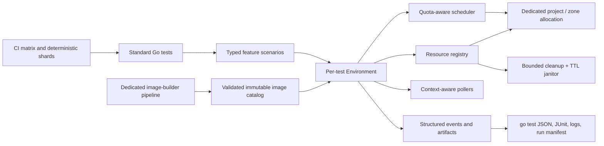

# Technical design: OS Config E2E test refactoring

## Recommendation

Replace the custom test executable incrementally with standard Go tests backed by a small OS Config-specific test environment library.

The target design should combine:

- Standard `testing.T`, subtests, `t.Cleanup`, and `t.Parallel`.
- Typed, table-driven test cases rather than a custom DSL.
- Context-aware, quota-aware scheduling with bounded concurrency.
- A unique resource namespace for every run and retry attempt.
- Explicit Arrange -> Act -> Await -> Assert phases.
- Structured diagnostics and per-test artifact bundles.
- No automatic whole-test retries in the test runner.
- Three semantic test groups: functional, compatibility, and install/upgrade.
- Only two execution schedules: presubmit and nightly. Both schedules run all three groups at different matrix depths.
- Pre-baked immutable images for functional tests, while compatibility and install/upgrade tests continue to use fresh public images.
- CI-level deterministic sharding, preferably with a dedicated project allocation per shard.

Do not increase parallelism until timeout, cleanup, and resource-ownership bugs are fixed. With the current implementation, additional concurrency would increase collisions and quota failures.

Estimated effort:

- Critical stabilization without changing the architecture: **2-4 engineer-weeks**.
- Standard Go harness and migration of all five suites: **8-12 engineer-weeks**.
- Full solution including the image pipeline, CI sharding, matrix redesign, janitor, observability, and burn-in: **14-20 engineer-weeks**, plus **2-3 weeks of reliability observation**.
- With two engineers, a realistic elapsed schedule is **8-12 weeks**, assuming cloud quota, image-project, and CI changes are available.

## 1. Scope and current state

The analyzed tree contains five suites:

- Guest policies
- OS policies
- Patch
- Inventory through guest attributes
- Inventory reporting API

There are no `*_test.go` files. The system is a custom executable that creates JUnit structures itself and schedules suites through goroutines in `e2e_tests/main.go`.

Depending on `agent_repo`, the test-data generators produce roughly **370-570 cloud test cases**. Most cases provision a dedicated VM, and failed cases may provision another one for the retry.

Although the code launches most cases concurrently, concurrency is uncontrolled:

- Hundreds of goroutines may be created immediately.
- VM creation is independently capped at ten in `e2e_tests/utils/utils.go`.
- Zone capacity is controlled by a polling allocator in `e2e_tests/test_config/project_config.go`.
- Guest-policy and OS-policy writes have separate global mutexes.
- API quotas and project selection are not coordinated.

Consequently, the implementation is neither meaningfully sequential nor safely parallel: it creates a burst of work that later blocks at unrelated bottlenecks.

## 2. Important findings

### 2.1 Timeout handling leaks live tests

The runner creates a timeout context but does not pass that context to the test function. After the timeout, it reports the case finished while the underlying goroutine continues running (`e2e_tests/test_runner/test_runner.go`).

This can produce the following sequence:

1. Attempt 1 times out.
2. Its goroutine continues owning a zone and VM.
3. Attempt 2 starts.
4. Both attempts mutate resources and test result objects.
5. Attempt 1 may later send output or perform cleanup after JUnit has been written.

Go cannot safely terminate an arbitrary goroutine. Cancellation must reach every blocking operation, and a test that refuses to stop should terminate its shard process rather than be left running.

### 2.2 Current whole-test retries cannot recover a failed run

The original failed JUnit case remains in the suite even if the retry succeeds. Therefore the retry usually adds cost without making the suite pass.

The suite implementations have several mutually inconsistent retry behaviors:

- The common runner emits both attempts.
- Guest policies and OS policies append the original failure and the rerun.
- Inventory may validate rerun data against the already-failed original case.
- Inventory reporting starts the retry concurrently with result processing.

Retries also reuse precomputed resource names in several suites, making collisions likely after a timeout.

### 2.3 A patch retry-duration bug can cause extreme hangs

Patch polling calls:

```go
retryutil.RetryAPICall(ctx, timeout*time.Second, ...)
```

`timeout` is already a `time.Duration`. Multiplying it by `time.Second` overflows:

- A 30-minute timeout becomes negative, effectively disabling retry.
- A 60-minute timeout becomes approximately 91 years.
- The context passed here is normally the uncancelled suite context because of the runner bug.

This is a plausible direct cause of one-hour test timeouts and leaked patch tests.

### 2.4 Capacity allocation can turn a quota timeout into a panic

`AcquireZone` returns an error message as though it were a zone name. VM creation later slices the value as a zone and derives a region using `zone[:len(zone)-2]`. Even where this does not panic, it produces a misleading API error instead of a capacity error.

The allocator also:

- Does not accept a context.
- Polls every ten seconds.
- Randomly chooses projects, potentially leaving one idle while another is saturated.
- Cannot express CPU, IP, disk, or API-specific capacity.
- Exists only in one process, so it cannot coordinate CI shards.

### 2.5 Panic and process-exit paths bypass cleanup and reporting

Examples include:

- `logger.Fatalf` inside suite goroutines.
- `panic` while generating guest-policy test data.
- Cleanup code that continues after failing to obtain a client.
- Serial-log recording that continues after `os.Create` fails and may dereference a nil file.

A panic or `Fatalf` can terminate the entire executable without complete JUnit output or cleanup.

### 2.6 Cleanup is best-effort and sometimes uses an expired context

VM deletion only prints errors. Other problems include:

- OS-policy deletion ignores the result of `op.Wait`.
- Cleanup often inherits the test context, which may already have expired.
- There is no central registry of resources created by a test.
- There is no janitor for resources left after process termination.
- A failed create call may have created a resource, but cleanup is only registered after a successful response.

This lets one failed run consume quota and destabilize subsequent runs.

### 2.7 Polling does not consistently model eventual consistency

Most polling helpers use `time.Tick` or `time.After`, ignore parent cancellation, and report only "timed out."

OS policy is particularly fragile: immediately after assignment creation, it performs one `GetOSPolicyAssignmentReport` call, even though the report is eventually consistent.

Timeout failures generally omit:

- Last observed state
- Last successful response
- Recent transient errors
- Operation name
- Project, zone, and resource identity
- Time spent in each phase

### 2.8 Startup readiness signals can be false positives

Several startup scripts do not use fail-fast behavior. Some retry installation and then deliberately continue after errors. The `install_done` guest attribute can therefore be written even when an earlier install step failed.

The harness interprets that attribute as "agent successfully installed," so failures are later attributed to policies or patch jobs instead of setup.

### 2.9 The test matrix mixes compatibility and feature coverage

Many feature scenarios are repeated across every supported image. For example, patch settings that merely verify "this configuration does not break anything" are run across large image maps.

This creates hundreds of expensive tests but does not necessarily increase meaningful coverage proportionally.

There is also a concrete coverage bug: `e2e_tests/test_suites/patch/test_setup.go` inserts `busterAptSetup` twice as a map key, causing one mapping to overwrite another at runtime.

## 3. Goals and non-goals

### Goals

The new system must ensure:

1. Every test owns its resources exclusively.
2. Every blocking operation is cancellable.
3. A timed-out test cannot continue in the background.
4. Every failure is assigned to a named phase and category.
5. Cleanup is attempted with an independent bounded context.
6. Parallelism never exceeds configured cloud capacity.
7. Test names and selection remain stable.
8. Adding a test requires primarily declaring inputs and assertions.
9. CI output uses standard tooling and preserves all attempts and artifacts.
10. A failed test can be reproduced using a recorded run manifest.
11. Presubmit covers every feature, every distinct platform implementation class, every supported image through compatibility smoke, and every installation backend.
12. Nightly initially preserves the complete feature-by-image interaction matrix.

### Non-goals

- Building a general-purpose workflow language.
- Sharing mutable VMs between unrelated tests.
- Treating retries as a substitute for fixing flaky tests.
- Replacing fresh-image compatibility and installation coverage with pre-baked images.
- Reimplementing generic assertion or JUnit libraries.

## 4. Considered approaches

| Approach | Advantages | Disadvantages | Estimate |
|---|---|---|---:|
| Harden the current runner | Fastest initial improvement; minimal suite changes | Retains custom lifecycle, JUnit, filters, and concurrency; future contributors must understand bespoke behavior | 2-4 weeks for stabilization; 5-7 for a credible runner |
| Standard Go `testing` - recommended | Familiar, stable subtests; panic attribution; `t.Cleanup`; standard filtering and tooling; smallest custom surface | Requires incremental suite migration; cloud scheduling still needs a custom library | 8-12 engineer-weeks |
| Ginkgo/Gomega | Rich lifecycle, reporting, labels, and expressive assertions | Adds a DSL and dependency; debugging execution order can be harder; does not solve cloud ownership or quotas | 10-14 engineer-weeks |
| Declarative YAML/workflow engine | Test matrices can be changed without Go; orchestration can run cases as separate processes | Weak type safety, complex schema evolution, harder debugging, significant framework ownership | 16-24 engineer-weeks |
| One process/job per case | Strong failure and panic isolation; simple hard timeouts | Hundreds of CI jobs, expensive setup, difficult global quotas and result management | 14-20 engineer-weeks plus CI work |

Standard Go testing provides the best balance. A typed scenario layer can supply readability without introducing a second programming language.

## 5. Proposed architecture



Suggested package structure:

```text
e2e_tests/
  internal/testenv/
    config.go
    clients.go
    environment.go
    scheduler.go
    resources.go
    polling.go
    artifacts.go
    errors.go
  internal/testimages/
    catalog.go
    manifest.go
  inventory/
    inventory_test.go
    cases.go
    assertions.go
  inventoryreporting/
  guestpolicies/
  ospolicies/
  patch/
  testdata/
  imagebuilder/
    manifests/
    scripts/
  cmd/e2e-janitor/
```

The cloud tests should live in an independently versioned module and require an explicit `e2e` build tag. A normal repository-wide `go test ./...` must compile and run local harness tests without creating cloud resources. CI and operators opt into provisioning with `go test -tags=e2e` plus an explicit run configuration.

### 5.1 Test structure

Each test should read as a short scenario:

```go
func TestGuestPolicy(t *testing.T) {
    for _, tc := range guestPolicyCases() {
        tc := tc
        t.Run(tc.ID, func(t *testing.T) {
            t.Parallel()

            env := testenv.New(t, tc.Requirements)
            vm := env.CreateVM(tc.Image, tc.Startup)

            env.Step("wait for agent readiness", func(ctx context.Context) error {
                return vm.WaitForAgent(ctx)
            })

            policy := env.CreateGuestPolicy(tc.Policy)

            env.Step("wait for desired state", func(ctx context.Context) error {
                return tc.Assert(ctx, vm, policy)
            })
        })
    }
}
```

Properties:

- Stable test IDs such as `package_install/debian-12`.
- Test data contains inputs and expected behavior, not execution plumbing.
- Helpers call `t.Helper()` or return wrapped errors.
- Assertions may accumulate multiple failures; one failure no longer overwrites another.
- Test code has no channels, wait groups, or JUnit objects.

The first POC iteration exposed a readability trap: a generic executor accepted `Feature` metadata but ran the same create-and-wait body for every feature. `Feature` must not be a decorative string or an implicit dispatcher. Each feature test should contain an explicit scenario body like the example above; tables should vary platform inputs and expectations within that body. Shared helpers may implement lifecycle and API mechanics, but the ordered product operations and semantic assertions must remain visible in the test file.

### 5.2 Per-test environment

`testenv.New` should create:

- A test-scoped context and deadline.
- A unique run ID and attempt ID.
- Structured logger.
- Project/zone lease.
- Injected client bundle.
- Resource cleanup registry.
- Artifact directory and manifest.

Resource names should contain a compact deterministic test hash plus a unique run/attempt suffix. Every resource should be labeled with:

- Run ID
- Test ID hash
- Shard
- Creation time
- Expiration time where supported

Resources must never be selected using a prefix shared by multiple attempts.

### 5.3 Resource lifecycle

Each create operation should follow:

1. Generate the final resource identity.
2. Register idempotent deletion by identity.
3. Call create.
4. Record the returned operation and resource metadata.
5. On cleanup, use a fresh bounded context derived from `context.Background`, not the expired test context.
6. Treat `NotFound` as successful cleanup.
7. Record cleanup errors separately without hiding the primary failure.

A periodic janitor should delete resources with expired E2E labels. It protects against machine termination and unrecoverable panics but does not replace per-test cleanup.

### 5.4 Scheduling and parallelism

Use two levels of control:

1. **CI sharding:** deterministically assign cases using a stable hash of test ID. Give each shard a dedicated project or explicit project/zone partition when possible.
2. **Within-process scheduling:** a context-aware weighted semaphore selects the least-loaded eligible project and zone.

The scheduler should return `(Lease, error)` and support cancellation. A lease can represent more than one dimension:

- VM count
- vCPU
- External IP
- Disk quota
- Per-API write rate

API write limits should use rate limiters with burst settings, not global mutexes.

Start with conservative concurrency and raise it based on metrics. Parallelism reduces wall-clock time but does not reduce VM-minutes and can worsen quota errors if treated as unlimited.

### 5.5 Timeouts and polling

Use one overall test budget and smaller phase budgets. All helpers accept `context.Context`.

Polling should:

- Check immediately before the first sleep.
- Use a stopped ticker or backoff implementation.
- Honor cancellation while sleeping.
- Retry only documented transient errors.
- Exit immediately on terminal failure states.
- Preserve the last state and recent errors.
- Include elapsed time, resource identity, and operation name in `WaitError`.

A timeout should resemble:

```text
phase "wait for OS policy compliance" exceeded 12m
resource: projects/p/locations/z/assignments/a
last state: ROLLOUT_IN_PROGRESS
last successful observation: 2026-07-21T12:04:31Z
recent errors: 2x Unavailable, last at 12:05:02Z
artifacts: .../os-policy-report.json, .../serial-port-1.log
```

### 5.6 Retry policy

Use retries only at the operation boundary:

- Retry `Unavailable`, selected `Internal`, `ResourceExhausted`, and transport errors.
- Use exponential backoff with jitter.
- Respect server retry hints.
- Stop on context cancellation.
- Do not retry invalid arguments, failed assertions, or product terminal states.

Do not silently turn a failed test green through an in-process whole-test retry.

During migration, CI may rerun a failed case once in a fresh process and namespace for classification. Both results must remain visible:

- First fail + second pass -> `FLAKY`
- Both fail with same cause -> deterministic failure
- Different causes -> unstable environment or insufficient diagnostics

Flaky cases should require an owner, issue, and expiry date. A quarantined case continues to run and report in nightly but does not silently pass presubmit; quarantine must be an explicit, temporary exception to the presubmit coverage contract rather than an indefinite skip.

## 6. Test matrix and performance design

The five existing feature areas remain the primary code organization:

- Guest policies
- OS policies
- Patch
- Inventory
- Inventory reporting

Every case also has one semantic category. Category and feature are independent dimensions:

```text
Feature:   guest policy | OS policy | patch | inventory | inventory reporting
Category:  functional | compatibility | install/upgrade
```

The categories are metadata used for coverage accounting and diagnostics. They are not separate repositories or separate CI schedules.

### 6.1 Current matrix size

With `agent_repo=""`, the current generators produce approximately:

| Existing suite | Cases |
|---|---:|
| Guest policies | 233 |
| OS policies | 168 |
| Patch | 105 |
| Inventory | 31 |
| Inventory reporting | 31 |
| **Total** | **568** |

Other agent-repository modes generate approximately 350-550 cases. The exact manifest must be generated in CI because the enabled SUSE, COS, old-image, and repository cases depend on configuration.

### 6.2 Functional group

Functional tests verify detailed product behavior. They run from immutable pre-baked candidate images containing the exact agent artifact under test.

Presubmit must use representatives for every materially different platform implementation, not merely one representative per package manager. The initial representative set should include:

- Debian 11
- Debian 12
- EL8
- EL9
- SLES 12
- SLES 15
- openSUSE
- Windows Server 2016
- Windows Server 2019
- At least one Windows Core variant
- COS where applicable

This gives approximately 10-12 platform classes. SAP, hardened, optimized, or other variants remain in detailed presubmit coverage when they exercise a different security, filesystem, package, service, or reboot path or have a history of image-specific regressions.

### 6.3 Compatibility group

Compatibility tests use unmodified public images and run one strong scenario on every enabled image family. The scenario verifies, where supported:

1. The VM boots.
2. The agent reaches verified readiness.
3. The expected agent version is running.
4. Inventory is reported.
5. A minimal policy operation succeeds.
6. A minimal patch operation succeeds.

These steps belong to one logical image-compatibility scenario and share one VM, but each step is timed and reported independently. If sharing obscures failures or causes state contamination for a platform, split that platform's compatibility checks into separate tests.

### 6.4 Install/upgrade group

Install and upgrade tests use fresh public images. They verify:

- Repository or artifact selection
- Package installation
- Installed version and digest
- Service enablement and startup
- Upgrade from each supported previous version
- Failure diagnostics for unsupported or invalid packages

Implementation of the POC exposed an important distinction: an unmodified public Compute Engine image may already contain an OS Config agent. "Fresh public image" therefore means an unmodified source image, not necessarily an agent-free image. An installation case must record the preinstalled version and either remove it before installing the candidate or select a source known not to contain it. An upgrade case must assert the exact starting version before applying the candidate. The manifest should also require a public test image to equal its recorded source image. Otherwise an apparent installation success may only prove that the preinstalled agent reported inventory, or a mislabeled pre-baked image may accidentally bypass the category boundary.

Presubmit covers every packaging backend and OS major. Nightly covers every applicable public image variant.

### 6.5 Presubmit contract

Presubmit runs all three groups:

| Group | Presubmit depth | Approximate cases |
|---|---|---:|
| Functional | Every feature on 10-12 platform classes | 160-210 |
| Compatibility | Strong smoke scenario on every enabled public image | 25-31 |
| Install/upgrade | Every packaging backend and OS major | 10-20 |
| **Total** | | **195-260** |

This is intended to be a correctness gate, not a small smoke test. A change cannot merge merely because it passed on one Debian, one EL, and one Windows image.

Presubmit guarantees the following coverage contract:

- Every feature behavior is exercised.
- Every distinct agent backend and OS major is exercised.
- Every supported public image is booted and receives a compatibility scenario.
- Every package installation backend is exercised.
- Known high-risk feature-image combinations remain explicit presubmit cases.
- No whole-test retry can silently turn the change green.

No finite E2E suite guarantees absence of all defects. The contract is designed to catch ordinary product, backend, image, and packaging regressions before merge while reserving the complete combinatorial interaction matrix for nightly.

### 6.6 Nightly contract

Nightly also runs all three groups, but initially retains the complete interaction coverage:

- Every detailed feature on every applicable supported image
- Compatibility scenario on every image
- Complete installation and upgrade matrix
- Old-image and reboot scenarios when configured

The initial nightly target remains approximately 500-600 cases. No feature-image combination should be removed solely to meet a runtime target. Matrix reduction can be considered later only after case manifests, historical regressions, and shadow-run results show that the reduced matrix detects the same failures.

There is no weekly tier. Nightly is the exhaustive safety net.

### 6.7 Performance estimate

Matrix restructuring reduces presubmit from approximately 568 to 195-260 VM-based cases, assuming the current full matrix is the baseline:

```text
VM-count reduction: approximately 54-66%
Case-count improvement: approximately 2.2-2.9x
```

Pre-baking removes repeated repository setup, dependency installation, agent installation, and bootstrap work from eligible functional cases. The current code permits 10-25 minutes for agent and startup readiness, although actual durations are not yet recorded by phase.

Planning estimates are:

| Scope | Expected improvement |
|---|---:|
| Eligible functional case duration from pre-baking | 25-50% |
| Presubmit compute work, matrix reduction plus pre-baking | 3-5x |
| Presubmit wall time at the same effective quota | 2-4x |
| Nightly wall time from pre-baking alone | 1.3-2x |
| Nightly wall time with deterministic sharding and adequate quota | 2-4x |

Nightly initially keeps approximately the same number of logical combinations, so its gains come from faster setup, removal of redundant retries, controlled concurrency, and sharding rather than reduced coverage.

These are capacity-planning estimates, not commitments. Phase-level telemetry must measure image preparation, VM provisioning, agent readiness, operation waiting, assertions, and cleanup before final concurrency and latency objectives are set.

### 6.8 Coverage safeguards

Before changing the matrix, generate a stable manifest containing:

- Feature and operation
- Image and resolved image ID
- OS family and major version
- Package manager and installation method
- Image variant such as SAP, Core, hardened, or optimized
- Agent artifact digest
- Reboot and policy capabilities

A feature-image combination remains in presubmit if it executes a different agent code path, package backend, service mechanism, security model, filesystem behavior, or reboot path, or if historical regressions show it is high risk.

During migration, run the old and new presubmit matrices in shadow mode and validate the proposal against known historical failures. Track failures found only by nightly. A sustained material number of nightly-only product regressions means the presubmit representative set is too weak.

Request-building, data conversion, package assertions, script generation, and unsupported configuration combinations should become local unit or fake-client tests. This improves coverage without provisioning additional VMs.

## 7. Pre-baked image design

This document uses **pre-baked image** to mean an immutable Compute Engine custom image prepared before the individual functional test VMs are created.

### 7.1 Applicability

| Test group | Image source | Reason |
|---|---|---|
| Functional | Pre-baked candidate image | Fast, deterministic environment containing the exact agent artifact |
| Compatibility | Original public image | Detects public-image and default-environment incompatibilities |
| Install/upgrade | Original public image | Preserves real package installation and upgrade coverage |

Pre-baked images must not replace fresh public-image tests. Doing so would hide repository, package installation, startup-script, dependency, and image-family regressions.

### 7.2 Image layers

Use two logical layers.

The **base image** is relatively long-lived and contains:

- OS-specific test prerequisites
- Logging and diagnostic configuration
- Static test scripts and readiness reporter
- Package-manager prerequisites
- Public test keys or certificates where appropriate

It does not contain credentials, policies, test IDs, previous test state, or the agent artifact under test.

The **candidate functional image** is produced for an agent artifact or commit:

```text
validated base image
+ exact agent package or binary under test
+ immutable bootstrap version
= candidate functional image
```

Creating a candidate image is worthwhile when several functional cases use it. If a platform has only one test, installing the artifact directly on a fresh VM is cheaper than building an image.

### 7.3 Ownership

Images are created automatically by a dedicated CI image-builder pipeline, not by test cases or individual developers.

| Responsibility | Owner |
|---|---|
| Image manifests and preparation scripts | OS Config E2E maintainers |
| Image build execution | Dedicated Cloud Build service account |
| Image project, IAM, network, and quota provisioning | Cloud infrastructure/project administrators |
| Candidate validation and publication | Automated image-builder pipeline |
| Expiration and deletion | Automated janitor |
| Image selection for a run | Test harness using a generated manifest |

The image definitions, scripts, and manifest schema live in this repository and are code reviewed like production test code.

The test harness enforces image provenance rather than relying only on convention: functional cases are rejected unless their manifest entry is a validated candidate, and compatibility or install/upgrade cases are rejected if their entry is a candidate.

### 7.4 Build and publication workflow

For each required platform class, the pipeline:

1. Resolves the public image family to a concrete immutable image ID.
2. Computes the source-image, bootstrap, prerequisite, and agent-artifact digests.
3. Reuses an already validated image only when all digests match.
4. Creates a temporary builder VM in the isolated image-builder project.
5. Installs prerequisites and diagnostics to produce or refresh the base image.
6. Installs the exact candidate agent artifact to produce the candidate image.
7. Verifies the expected agent version, digest, and service state.
8. Removes logs, temporary files, credentials, package caches, machine-specific state, and earlier test state.
9. Uses the supported generalization process for the platform, including Windows image preparation where required.
10. Creates an immutable Compute Engine custom image.
11. Boots a validation VM and runs readiness and sanity checks.
12. Publishes the image manifest only after validation succeeds.
13. Deletes all temporary builder and validation resources.

The 10-12 presubmit candidates should be built concurrently within a separate bounded quota. Nightly may prepare candidates for every enabled image because each candidate is then reused by many detailed feature cases.

Presubmit should never silently fall back to an older candidate. If preparation fails, the affected platform fails with category `IMAGE_PREPARATION`, while independent compatibility and install cases may continue collecting results.

### 7.5 Storage and IAM

Store VM images as Compute Engine custom images in a dedicated GCP image project, separate from the projects where tests execute. The exact project name is an infrastructure decision; conceptually:

```text
osconfig-e2e-images          immutable shared image catalog
osconfig-e2e-test-project-1  shard-owned runtime resources
osconfig-e2e-test-project-2  shard-owned runtime resources
osconfig-e2e-test-project-3  shard-owned runtime resources
```

Use GCS or Artifact Registry for agent packages, test binaries, checksums, build manifests, and logs. Do not treat a GCS object as the runtime VM image when Compute Engine custom images provide the required immutable boot source.

The builder service account receives the minimum permissions required to create temporary builder resources and publish, deprecate, and delete images. Test-runner service accounts receive read/use permission on published images and no permission to modify the shared catalog.

Untrusted changes must build only in an isolated project with restricted credentials, network access, and publication permissions. An untrusted build must not be able to overwrite a trusted image alias or poison a shared cache entry.

### 7.6 Identity, manifest, and retention

The image cache key includes:

```text
concrete source image ID
+ platform class
+ bootstrap script digest
+ prerequisite manifest digest
+ agent artifact digest
```

Conceptual immutable image name:

```text
e2e-debian12-src8f31-boot91ac-agent23bd
```

Each run consumes a generated manifest containing at least:

```json
{
  "debian-12": {
    "image": "projects/IMAGE_PROJECT/global/images/e2e-debian12-src8f31-boot91ac-agent23bd",
    "source_image": "projects/debian-cloud/global/images/debian-12-bookworm-v20260715",
    "agent_digest": "sha256:23bd...",
    "bootstrap_digest": "sha256:91ac..."
  }
}
```

Tests resolve this manifest once and use concrete image resources rather than resolving `latest` independently.

Recommended retention:

- Base images: current and previous validated version per source image, generally 30-90 days.
- Presubmit candidate images: 7-14 days.
- Nightly or release candidate images: 14-30 days.
- Failed or unvalidated images: delete immediately or retain briefly in quarantine for diagnosis.

Before deletion, deprecate the image and verify that no active manifest references it. The janitor deletes only expired, unreferenced images.

### 7.7 Runtime isolation

Sharing an immutable image does not mean sharing runtime state. Every test attempt still owns:

- A newly created VM and boot disk
- A unique run ID and attempt ID
- Unique policy and assignment resources
- Its own project/zone lease
- Its own artifact directory and cleanup registry

Do not introduce a pool of reusable running VMs. Reusing live VMs would carry package state, guest attributes, reboot counts, agent state, and filesystem changes between tests. Reuse is allowed only within the steps of one logical scenario that owns the VM from creation through deletion.

## 8. Failure diagnostics

Every result should have one primary category:

- `SETUP`
- `INFRA_TRANSIENT`
- `CAPACITY`
- `PRODUCT_API`
- `PRODUCT_STATE`
- `ASSERTION`
- `TIMEOUT`
- `PANIC`
- `CLEANUP`

Each test should publish:

- `manifest.json`: run, attempt, test ID, commit, resolved images, project, zone, and resources.
- `events.jsonl`: timestamped phases and API operation summaries.
- Serial-console output.
- Startup-script output and exit status.
- Relevant OS Config resource snapshots.
- Polling history or at least the last observations.
- Panic stack, if applicable.
- Cleanup report.
- Standard `go test -json` output and generated JUnit.

Never log secrets, access tokens, or complete credential-bearing requests.

## 9. Immediate stabilization work

These changes should land before the migration:

1. Correct `timeout*time.Second`.
2. Remove automatic whole-test retry or make it a separately reported fresh attempt.
3. Change test function signatures to accept the attempt context.
4. Require timed-out attempts to exit; terminate the shard if they do not stop within a short grace period.
5. Make zone acquisition return an error and honor context cancellation.
6. Replace random project selection with least-loaded deterministic selection.
7. Use unique names per attempt.
8. Make all cleanup idempotent and use a fresh bounded cleanup context.
9. Return immediately after log-file creation or client acquisition failures.
10. Replace `Fatalf`, `os.Exit`, and setup `panic` with attributed test failures.
11. Fix OS-policy report polling.
12. Replace `time.Tick` with stoppable, context-aware waiters.
13. Make startup scripts publish explicit phase, exit code, and error output.
14. Fix the duplicate APT setup key.
15. Align the Docker Go version with `go.mod`; they currently declare Go 1.24.3 and Go 1.25 respectively.

These fixes improve the current system even if the full migration is delayed.

## 10. Migration plan and estimates

| Phase | Work | Estimate |
|---|---|---:|
| 0. Baseline | Add run IDs, timing and failure classification; measure current flake rate and suite duration | 1-2 weeks |
| 1. Critical stabilization | Timeout, retry, allocator, polling, panic and cleanup fixes | 2-4 weeks |
| 2. New harness | `testenv`, scheduler, resource registry, artifact writer, fake-client unit tests | 2-3 weeks |
| 3. Image pipeline | Dedicated image project integration, base/candidate builders, validation, manifest, IAM, and janitor | 2-4 weeks |
| 4. Pilot migration | Inventory and inventory-reporting suites; shadow-run old and new | 1.5-2.5 weeks |
| 5. Policy migration | Guest policies and OS policies; split builders from scenarios | 3-4 weeks |
| 6. Patch migration | Patch lifecycle, reboot diagnostics, pre/post-step assertions | 2-3 weeks |
| 7. CI and matrix redesign | Presubmit/nightly manifests, sharding, JUnit conversion, and dashboards | 2-3 weeks |
| 8. Burn-in and deletion | Compare coverage, remove old runner after reliability threshold | 2-3 elapsed weeks |

Some work can overlap. The full estimate is not the sum of all maxima because harness, CI, and suite migrations can proceed in parallel.

## 11. Rollout and risk control

Use a strangler migration:

1. Keep the current suite filter.
2. Add new Go suites one feature at a time.
3. Run old and new implementations against different run namespaces.
4. Gate only on the old implementation initially.
5. Compare coverage, duration, and result disagreement.
6. Switch gating suite-by-suite.
7. Retain the old suite for one short fallback window.
8. Delete its code after the new suite meets reliability targets.

Important risks:

- **Coverage regression:** generate and compare stable case manifests from old and new systems.
- **Quota spikes:** begin with low shard and worker counts; raise from observed utilization.
- **Behavior changes caused by latest image families:** resolve family names to concrete images at run start and record them.
- **External repository flakiness:** pin controlled artifacts where practical and distinguish repository failures from product failures.
- **Cleanup permission gaps:** test the janitor in report-only mode before enabling deletion.
- **Pre-baked images hide installation defects:** use them only for functional tests; keep compatibility and install/upgrade on fresh public images.
- **Stale or poisoned image cache:** key images by immutable digests, validate before publication, isolate untrusted builds, and grant test runners read-only image access.
- **Image build latency:** cache validated base layers, build platform candidates concurrently, and use candidate images only when their setup cost is amortized across several cases.

## 12. Acceptance criteria

The refactor is complete when:

- No test continues after its result is published.
- No known path uses `Fatalf`, `os.Exit`, or an unreported panic during a case.
- Every cloud resource has run/test labels and registered cleanup.
- No expired resource remains for more than 24 hours.
- At least 99% of healthy cases pass across 30 consecutive scheduled runs.
- Whole-test reruns occur in fewer than 1% of executions.
- Every timeout includes phase, resource identity, last state, and artifact references.
- Presubmit executes all three semantic groups and satisfies the platform, image, and packaging coverage contract.
- Nightly preserves the complete feature-image interaction matrix until evidence explicitly approves a reduction.
- Every functional result records the concrete source image, candidate image, agent digest, and bootstrap digest.
- Compatibility and install/upgrade tests never substitute a pre-baked image for the required fresh public image.
- Ordinary untagged Go test commands cannot provision cloud resources; cloud scenarios require the explicit `e2e` build tag and run configuration.
- Installation results record the preexisting agent version or absence, candidate artifact digest, installed version, and service state.
- Presubmit completes within 60 minutes at p95 under the agreed quota after image-cache warm-up.
- Full nightly suites complete within 120 minutes at p95 under the agreed quota.
- Harness and assertion code has local unit coverage and passes `go test -race`.
- The old custom runner and custom JUnit lifecycle are removed.

The most important architectural choice is to keep the new custom layer thin: cloud resource ownership, scheduling, polling, and diagnostics are project-specific; test lifecycle, filtering, panic reporting, and result collection should be left to Go's standard test framework.
