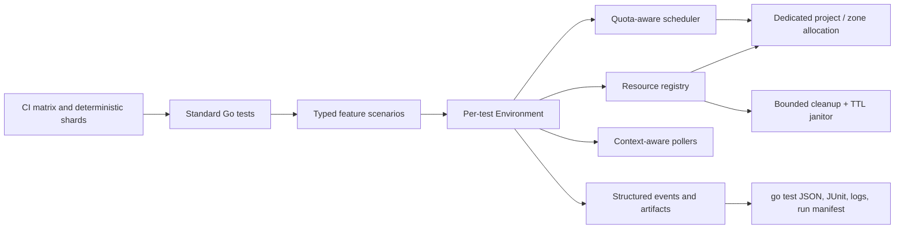

# Technical design: OS Config E2E test refactoring

## Recommendation

Replace the custom test executable incrementally with standard Go tests backed by a small OS Config-specific test environment library.

The target design should combine:

- Standard `testing.T`, subtests, `t.Cleanup`, and `t.Parallel`.
- Typed, table-driven test cases rather than a custom DSL.
- Context-aware, quota-aware scheduling with bounded concurrency.
- A unique resource namespace for every run and retry attempt.
- Explicit Arrange -> Act -> Await -> Assert phases.
- Structured diagnostics and per-test artifact bundles.
- No automatic whole-test retries in the test runner.
- Separate functional, compatibility, and exhaustive test matrices.
- CI-level deterministic sharding, preferably with a dedicated project allocation per shard.

Do not increase parallelism until timeout, cleanup, and resource-ownership bugs are fixed. With the current implementation, additional concurrency would increase collisions and quota failures.

Estimated effort:

- Critical stabilization without changing the architecture: **2-4 engineer-weeks**.
- Standard Go harness and migration of all five suites: **8-12 engineer-weeks**.
- Full solution including CI sharding, test-tier redesign, janitor, observability, and burn-in: **12-16 engineer-weeks**, plus **2-3 weeks of reliability observation**.
- With two engineers, a realistic elapsed schedule is **7-10 weeks**, assuming cloud quota and CI changes are available.

## 1. Scope and current state

The analyzed tree contains five suites:

- Guest policies
- OS policies
- Patch
- Inventory through guest attributes
- Inventory reporting API

There are no `*_test.go` files. The system is a custom executable that creates JUnit structures itself and schedules suites through goroutines in `e2e_tests/main.go`.

Depending on `agent_repo`, the test-data generators produce roughly **370-570 cloud test cases**. Most cases provision a dedicated VM, and failed cases may provision another one for the retry.

Although the code launches most cases concurrently, concurrency is uncontrolled:

- Hundreds of goroutines may be created immediately.
- VM creation is independently capped at ten in `e2e_tests/utils/utils.go`.
- Zone capacity is controlled by a polling allocator in `e2e_tests/test_config/project_config.go`.
- Guest-policy and OS-policy writes have separate global mutexes.
- API quotas and project selection are not coordinated.

Consequently, the implementation is neither meaningfully sequential nor safely parallel: it creates a burst of work that later blocks at unrelated bottlenecks.

## 2. Important findings

### 2.1 Timeout handling leaks live tests

The runner creates a timeout context but does not pass that context to the test function. After the timeout, it reports the case finished while the underlying goroutine continues running (`e2e_tests/test_runner/test_runner.go`).

This can produce the following sequence:

1. Attempt 1 times out.
2. Its goroutine continues owning a zone and VM.
3. Attempt 2 starts.
4. Both attempts mutate resources and test result objects.
5. Attempt 1 may later send output or perform cleanup after JUnit has been written.

Go cannot safely terminate an arbitrary goroutine. Cancellation must reach every blocking operation, and a test that refuses to stop should terminate its shard process rather than be left running.

### 2.2 Current whole-test retries cannot recover a failed run

The original failed JUnit case remains in the suite even if the retry succeeds. Therefore the retry usually adds cost without making the suite pass.

The suite implementations have several mutually inconsistent retry behaviors:

- The common runner emits both attempts.
- Guest policies and OS policies append the original failure and the rerun.
- Inventory may validate rerun data against the already-failed original case.
- Inventory reporting starts the retry concurrently with result processing.

Retries also reuse precomputed resource names in several suites, making collisions likely after a timeout.

### 2.3 A patch retry-duration bug can cause extreme hangs

Patch polling calls:

```go
retryutil.RetryAPICall(ctx, timeout*time.Second, ...)
```

`timeout` is already a `time.Duration`. Multiplying it by `time.Second` overflows:

- A 30-minute timeout becomes negative, effectively disabling retry.
- A 60-minute timeout becomes approximately 91 years.
- The context passed here is normally the uncancelled suite context because of the runner bug.

This is a plausible direct cause of one-hour test timeouts and leaked patch tests.

### 2.4 Capacity allocation can turn a quota timeout into a panic

`AcquireZone` returns an error message as though it were a zone name. VM creation later slices the value as a zone and derives a region using `zone[:len(zone)-2]`. Even where this does not panic, it produces a misleading API error instead of a capacity error.

The allocator also:

- Does not accept a context.
- Polls every ten seconds.
- Randomly chooses projects, potentially leaving one idle while another is saturated.
- Cannot express CPU, IP, disk, or API-specific capacity.
- Exists only in one process, so it cannot coordinate CI shards.

### 2.5 Panic and process-exit paths bypass cleanup and reporting

Examples include:

- `logger.Fatalf` inside suite goroutines.
- `panic` while generating guest-policy test data.
- Cleanup code that continues after failing to obtain a client.
- Serial-log recording that continues after `os.Create` fails and may dereference a nil file.

A panic or `Fatalf` can terminate the entire executable without complete JUnit output or cleanup.

### 2.6 Cleanup is best-effort and sometimes uses an expired context

VM deletion only prints errors. Other problems include:

- OS-policy deletion ignores the result of `op.Wait`.
- Cleanup often inherits the test context, which may already have expired.
- There is no central registry of resources created by a test.
- There is no janitor for resources left after process termination.
- A failed create call may have created a resource, but cleanup is only registered after a successful response.

This lets one failed run consume quota and destabilize subsequent runs.

### 2.7 Polling does not consistently model eventual consistency

Most polling helpers use `time.Tick` or `time.After`, ignore parent cancellation, and report only "timed out."

OS policy is particularly fragile: immediately after assignment creation, it performs one `GetOSPolicyAssignmentReport` call, even though the report is eventually consistent.

Timeout failures generally omit:

- Last observed state
- Last successful response
- Recent transient errors
- Operation name
- Project, zone, and resource identity
- Time spent in each phase

### 2.8 Startup readiness signals can be false positives

Several startup scripts do not use fail-fast behavior. Some retry installation and then deliberately continue after errors. The `install_done` guest attribute can therefore be written even when an earlier install step failed.

The harness interprets that attribute as "agent successfully installed," so failures are later attributed to policies or patch jobs instead of setup.

### 2.9 The test matrix mixes compatibility and feature coverage

Many feature scenarios are repeated across every supported image. For example, patch settings that merely verify "this configuration does not break anything" are run across large image maps.

This creates hundreds of expensive tests but does not necessarily increase meaningful coverage proportionally.

There is also a concrete coverage bug: `e2e_tests/test_suites/patch/test_setup.go` inserts `busterAptSetup` twice as a map key, causing one mapping to overwrite another at runtime.

## 3. Goals and non-goals

### Goals

The new system must ensure:

1. Every test owns its resources exclusively.
2. Every blocking operation is cancellable.
3. A timed-out test cannot continue in the background.
4. Every failure is assigned to a named phase and category.
5. Cleanup is attempted with an independent bounded context.
6. Parallelism never exceeds configured cloud capacity.
7. Test names and selection remain stable.
8. Adding a test requires primarily declaring inputs and assertions.
9. CI output uses standard tooling and preserves all attempts and artifacts.
10. A failed test can be reproduced using a recorded run manifest.

### Non-goals

- Building a general-purpose workflow language.
- Sharing mutable VMs between unrelated tests.
- Treating retries as a substitute for fixing flaky tests.
- Making the full image matrix suitable for every presubmit.
- Reimplementing generic assertion or JUnit libraries.

## 4. Considered approaches

| Approach | Advantages | Disadvantages | Estimate |
|---|---|---|---:|
| Harden the current runner | Fastest initial improvement; minimal suite changes | Retains custom lifecycle, JUnit, filters, and concurrency; future contributors must understand bespoke behavior | 2-4 weeks for stabilization; 5-7 for a credible runner |
| Standard Go `testing` - recommended | Familiar, stable subtests; panic attribution; `t.Cleanup`; standard filtering and tooling; smallest custom surface | Requires incremental suite migration; cloud scheduling still needs a custom library | 8-12 engineer-weeks |
| Ginkgo/Gomega | Rich lifecycle, reporting, labels, and expressive assertions | Adds a DSL and dependency; debugging execution order can be harder; does not solve cloud ownership or quotas | 10-14 engineer-weeks |
| Declarative YAML/workflow engine | Test matrices can be changed without Go; orchestration can run cases as separate processes | Weak type safety, complex schema evolution, harder debugging, significant framework ownership | 16-24 engineer-weeks |
| One process/job per case | Strong failure and panic isolation; simple hard timeouts | Hundreds of CI jobs, expensive setup, difficult global quotas and result management | 14-20 engineer-weeks plus CI work |

Standard Go testing provides the best balance. A typed scenario layer can supply readability without introducing a second programming language.

## 5. Proposed architecture



Suggested package structure:

```text
e2e_tests/
  internal/testenv/
    config.go
    clients.go
    environment.go
    scheduler.go
    resources.go
    polling.go
    artifacts.go
    errors.go
  inventory/
    inventory_test.go
    cases.go
    assertions.go
  inventoryreporting/
  guestpolicies/
  ospolicies/
  patch/
  testdata/
  cmd/e2e-janitor/
```

### 5.1 Test structure

Each test should read as a short scenario:

```go
func TestGuestPolicy(t *testing.T) {
    for _, tc := range guestPolicyCases() {
        tc := tc
        t.Run(tc.ID, func(t *testing.T) {
            t.Parallel()

            env := testenv.New(t, tc.Requirements)
            vm := env.CreateVM(tc.Image, tc.Startup)

            env.Step("wait for agent readiness", func(ctx context.Context) error {
                return vm.WaitForAgent(ctx)
            })

            policy := env.CreateGuestPolicy(tc.Policy)

            env.Step("wait for desired state", func(ctx context.Context) error {
                return tc.Assert(ctx, vm, policy)
            })
        })
    }
}
```

Properties:

- Stable test IDs such as `package_install/debian-12`.
- Test data contains inputs and expected behavior, not execution plumbing.
- Helpers call `t.Helper()` or return wrapped errors.
- Assertions may accumulate multiple failures; one failure no longer overwrites another.
- Test code has no channels, wait groups, or JUnit objects.

### 5.2 Per-test environment

`testenv.New` should create:

- A test-scoped context and deadline.
- A unique run ID and attempt ID.
- Structured logger.
- Project/zone lease.
- Injected client bundle.
- Resource cleanup registry.
- Artifact directory and manifest.

Resource names should contain a compact deterministic test hash plus a unique run/attempt suffix. Every resource should be labeled with:

- Run ID
- Test ID hash
- Shard
- Creation time
- Expiration time where supported

Resources must never be selected using a prefix shared by multiple attempts.

### 5.3 Resource lifecycle

Each create operation should follow:

1. Generate the final resource identity.
2. Register idempotent deletion by identity.
3. Call create.
4. Record the returned operation and resource metadata.
5. On cleanup, use a fresh bounded context derived from `context.Background`, not the expired test context.
6. Treat `NotFound` as successful cleanup.
7. Record cleanup errors separately without hiding the primary failure.

A periodic janitor should delete resources with expired E2E labels. It protects against machine termination and unrecoverable panics but does not replace per-test cleanup.

### 5.4 Scheduling and parallelism

Use two levels of control:

1. **CI sharding:** deterministically assign cases using a stable hash of test ID. Give each shard a dedicated project or explicit project/zone partition when possible.
2. **Within-process scheduling:** a context-aware weighted semaphore selects the least-loaded eligible project and zone.

The scheduler should return `(Lease, error)` and support cancellation. A lease can represent more than one dimension:

- VM count
- vCPU
- External IP
- Disk quota
- Per-API write rate

API write limits should use rate limiters with burst settings, not global mutexes.

Start with conservative concurrency and raise it based on metrics. Parallelism reduces wall-clock time but does not reduce VM-minutes and can worsen quota errors if treated as unlimited.

### 5.5 Timeouts and polling

Use one overall test budget and smaller phase budgets. All helpers accept `context.Context`.

Polling should:

- Check immediately before the first sleep.
- Use a stopped ticker or backoff implementation.
- Honor cancellation while sleeping.
- Retry only documented transient errors.
- Exit immediately on terminal failure states.
- Preserve the last state and recent errors.
- Include elapsed time, resource identity, and operation name in `WaitError`.

A timeout should resemble:

```text
phase "wait for OS policy compliance" exceeded 12m
resource: projects/p/locations/z/assignments/a
last state: ROLLOUT_IN_PROGRESS
last successful observation: 2026-07-21T12:04:31Z
recent errors: 2x Unavailable, last at 12:05:02Z
artifacts: .../os-policy-report.json, .../serial-port-1.log
```

### 5.6 Retry policy

Use retries only at the operation boundary:

- Retry `Unavailable`, selected `Internal`, `ResourceExhausted`, and transport errors.
- Use exponential backoff with jitter.
- Respect server retry hints.
- Stop on context cancellation.
- Do not retry invalid arguments, failed assertions, or product terminal states.

Do not silently turn a failed test green through an in-process whole-test retry.

During migration, CI may rerun a failed case once in a fresh process and namespace for classification. Both results must remain visible:

- First fail + second pass -> `FLAKY`
- Both fail with same cause -> deterministic failure
- Different causes -> unstable environment or insufficient diagnostics

Flaky cases should require an owner, issue, expiry date, and separate non-gating lane. Quarantine must not become an indefinite skip.

## 6. Test matrix redesign

Separate product semantics from image compatibility.

### Functional suite

Run detailed feature assertions on one representative image per package manager or OS family:

- Debian/APT
- EL/YUM
- SUSE/Zypper
- Windows/GooGet
- COS where relevant

### Compatibility suite

Run a minimal scenario on every supported image:

- VM boots.
- Agent reaches verified readiness.
- Correct version is installed.
- One minimal inventory/policy/patch operation succeeds.

### Exhaustive suite

Run broader combinations nightly or weekly:

- All image families
- Old images
- Reboot scenarios
- Repository variants
- Full policy resource combinations

Request-building, data conversion, package assertions, and script generation should become local unit tests with fake clients. This should remove many expensive "configuration did not break" cloud cases.

Proposed CI tiers:

| Tier | Contents | Target |
|---|---|---|
| Presubmit smoke | Representative images and critical paths | p95 under 45 minutes |
| Nightly functional | All functional scenarios, sharded | p95 under 90 minutes |
| Nightly compatibility | Minimal test on every image | p95 under 90 minutes |
| Weekly exhaustive | Old images and broad combinations | Duration secondary to coverage |

## 7. Failure diagnostics

Every result should have one primary category:

- `SETUP`
- `INFRA_TRANSIENT`
- `CAPACITY`
- `PRODUCT_API`
- `PRODUCT_STATE`
- `ASSERTION`
- `TIMEOUT`
- `PANIC`
- `CLEANUP`

Each test should publish:

- `manifest.json`: run, attempt, test ID, commit, resolved images, project, zone, and resources.
- `events.jsonl`: timestamped phases and API operation summaries.
- Serial-console output.
- Startup-script output and exit status.
- Relevant OS Config resource snapshots.
- Polling history or at least the last observations.
- Panic stack, if applicable.
- Cleanup report.
- Standard `go test -json` output and generated JUnit.

Never log secrets, access tokens, or complete credential-bearing requests.

## 8. Immediate stabilization work

These changes should land before the migration:

1. Correct `timeout*time.Second`.
2. Remove automatic whole-test retry or make it a separately reported fresh attempt.
3. Change test function signatures to accept the attempt context.
4. Require timed-out attempts to exit; terminate the shard if they do not stop within a short grace period.
5. Make zone acquisition return an error and honor context cancellation.
6. Replace random project selection with least-loaded deterministic selection.
7. Use unique names per attempt.
8. Make all cleanup idempotent and use a fresh bounded cleanup context.
9. Return immediately after log-file creation or client acquisition failures.
10. Replace `Fatalf`, `os.Exit`, and setup `panic` with attributed test failures.
11. Fix OS-policy report polling.
12. Replace `time.Tick` with stoppable, context-aware waiters.
13. Make startup scripts publish explicit phase, exit code, and error output.
14. Fix the duplicate APT setup key.
15. Align the Docker Go version with `go.mod`; they currently declare Go 1.24.3 and Go 1.25 respectively.

These fixes improve the current system even if the full migration is delayed.

## 9. Migration plan and estimates

| Phase | Work | Estimate |
|---|---|---:|
| 0. Baseline | Add run IDs, timing and failure classification; measure current flake rate and suite duration | 1-2 weeks |
| 1. Critical stabilization | Timeout, retry, allocator, polling, panic and cleanup fixes | 2-4 weeks |
| 2. New harness | `testenv`, scheduler, resource registry, artifact writer, fake-client unit tests | 2-3 weeks |
| 3. Pilot migration | Inventory and inventory-reporting suites; shadow-run old and new | 1.5-2.5 weeks |
| 4. Policy migration | Guest policies and OS policies; split builders from scenarios | 3-4 weeks |
| 5. Patch migration | Patch lifecycle, reboot diagnostics, pre/post-step assertions | 2-3 weeks |
| 6. CI and matrix redesign | Sharding, tiers, JUnit conversion, janitor, dashboards | 2-3 weeks |
| 7. Burn-in and deletion | Compare coverage, remove old runner after reliability threshold | 2-3 elapsed weeks |

Some work can overlap. The full estimate is not the sum of all maxima because harness, CI, and suite migrations can proceed in parallel.

## 10. Rollout and risk control

Use a strangler migration:

1. Keep the current suite filter.
2. Add new Go suites one feature at a time.
3. Run old and new implementations against different run namespaces.
4. Gate only on the old implementation initially.
5. Compare coverage, duration, and result disagreement.
6. Switch gating suite-by-suite.
7. Retain the old suite for one short fallback window.
8. Delete its code after the new suite meets reliability targets.

Important risks:

- **Coverage regression:** generate and compare stable case manifests from old and new systems.
- **Quota spikes:** begin with low shard and worker counts; raise from observed utilization.
- **Behavior changes caused by latest image families:** resolve family names to concrete images at run start and record them.
- **External repository flakiness:** pin controlled artifacts where practical and distinguish repository failures from product failures.
- **Cleanup permission gaps:** test the janitor in report-only mode before enabling deletion.

## 11. Acceptance criteria

The refactor is complete when:

- No test continues after its result is published.
- No known path uses `Fatalf`, `os.Exit`, or an unreported panic during a case.
- Every cloud resource has run/test labels and registered cleanup.
- No expired resource remains for more than 24 hours.
- At least 99% of healthy cases pass across 30 consecutive scheduled runs.
- Whole-test reruns occur in fewer than 1% of executions.
- Every timeout includes phase, resource identity, last state, and artifact references.
- Presubmit smoke completes within 45 minutes at p95.
- Full nightly suites complete within 90 minutes at p95 under the agreed quota.
- Harness and assertion code has local unit coverage and passes `go test -race`.
- The old custom runner and custom JUnit lifecycle are removed.

The most important architectural choice is to keep the new custom layer thin: cloud resource ownership, scheduling, polling, and diagnostics are project-specific; test lifecycle, filtering, panic reporting, and result collection should be left to Go's standard test framework.
